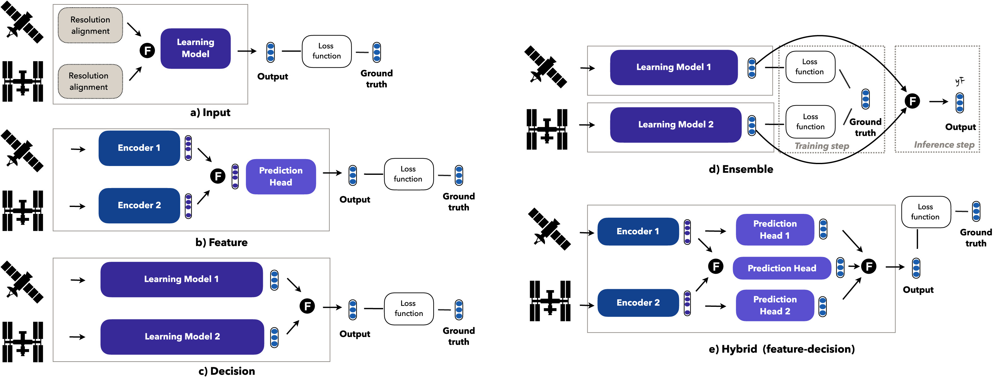
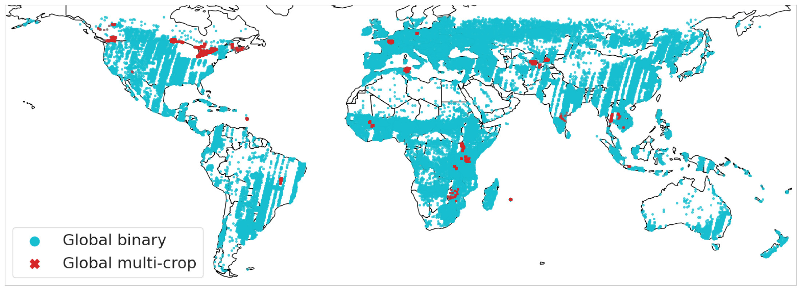

# In the search for an optimal multi-view crop classifier
[](https://doi.org/10.1016/j.jag.2025.104823)
[](https://www.arxiv.org/abs/2308.05407) 
<a href="https://github.com/fmenat/mvlearning">    </a> 

> Public repository of our comparative work on various data fusion strategies and encoder architectures for crop classification.
---



### Training
* To train the Input fusion strategy:  
```
python train_singleview.py -s config/singleview_ex.yaml
```
* To train the Ensemble aggregation strategy:  
```
python train_singleview_pool.py -s config/singleviewpool_ex.yaml
```
* To train strategies based on multiple encoders: Feature, Decision, and Hybrid fusion strategies:
```
python train_multiview.py -s config/multiview_ex.yaml
```

## Data



The data used comes from https://github.com/nasaharvest/cropharvest. However, we also share the code used to generate the data structures that we used in [data folder](./data).


### Evaluation
* To evaluate the model by its predictions (performance):
```
python evaluate_predictions.py -s config/evaluation_ex.yaml
```


## Installation
Please install the required packages with the following command:
```
pip install -r requirements.txt
```

# 🖊️ Citation

Mena, Francisco, et al. "*In the search for optimal multi-view learning models for crop classification with global remote sensing data*." International Journal of Applied Earth Observation and Geoinformation, 2025.
```bibtex
@article{mena2025optimal,
  title = {In the search for optimal multi-view learning models for crop classification with global remote sensing data},
  author = {Mena, Francisco and Arenas, Diego and Dengel, Andreas},
  journal = {International Journal of Applied Earth Observation and Geoinformation},
  year = {2025},
  doi = {10.1016/j.jag.2025.104823},
  volume={143},
}
```
